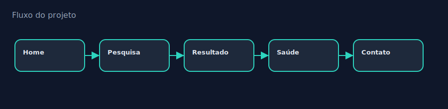
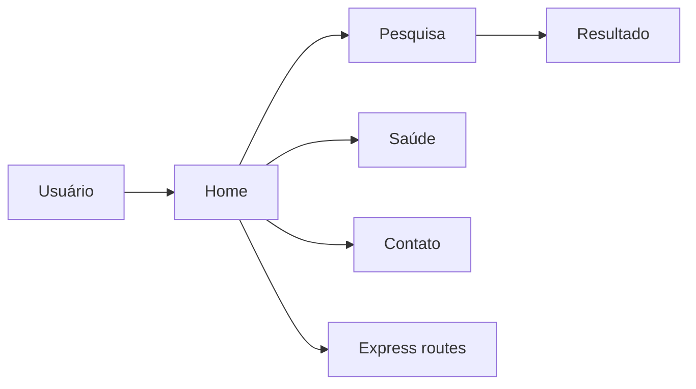

<div align="center">


# Search UNIVESP Project

### Projeto integrador UNIVESP com pesquisa, páginas de saúde e contato


[Sobre](#-sobre) ·
[Features](#-features) ·
[Arquitetura](#-arquitetura--fluxo) ·
[Stack](#-stack) ·
[Estrutura](#-estrutura) ·
[Setup](#-como-rodar) ·
[Melhorias](#-melhorias-sugeridas) ·
[Autor](#-autor)

</div>

---

## 📌 Sobre

Aplicação web do Projeto Integrador III: páginas estáticas/EJS para **pesquisa**, **saúde**, **contato** e backend Express com rotas e includes.

<div align="center">



</div>

---

## ✨ Features

| # | Capacidade |
|---|------------|
| 1 | Express `app.js` + `routes/` |
| 2 | Views EJS |
| 3 | Páginas `pesquisa.html`, `saude.html`, `contato.html` |
| 4 | Assets em `assests/` / `public/` |

---

## 🏗️ Arquitetura / Fluxo



---

## 🛠️ Stack

| Tecnologia | Papel |
|------------|-------|
| Express | Servidor |
| EJS | Templates |
| HTML/CSS/JS | Front |

---

## 📂 Estrutura

```text
SearchUnivespProject/
├── app.js
├── routes/
├── views/
├── public/
├── assests/
├── pesquisa.html
├── saude.html
└── contato.html
```

---

## 🚀 Como rodar

```bash
git clone https://github.com/CanonEngineer/SearchUnivespProject.git
cd SearchUnivespProject
npm install
npm start
```

---

## ▶️ Uso

Navegue pelas páginas de pesquisa e saúde; use o formulário de contato quando disponível.

---

## 🌳 Tree of Knowledge

Este projeto está mapeado na árvore interativa:

<p>
  <a href="https://canonengineer.github.io/TreeofKnowledge/index.html?tree=search-univesp">
    
  </a>
</p>

---

## 📈 Melhorias sugeridas

1. Corrigir pasta `assests` → `assets`
2. Busca real em base/API
3. Remover `node_modules` do Git
4. Acessibilidade e SEO

---

## 👨‍💻 Autor

**Alessandro Canon (CanonEngineer)**  
Network Analyst · Developer · Cybersecurity Enthusiast

- GitHub: [https://github.com/CanonEngineer](https://github.com/CanonEngineer)
- Portfolio: [https://canonengineer.github.io](https://canonengineer.github.io)
- Tree of Knowledge: [https://canonengineer.github.io/TreeofKnowledge/](https://canonengineer.github.io/TreeofKnowledge/)

---

<div align="center">

⭐ Se este projeto te ajudou, deixe uma estrela!

</div>
